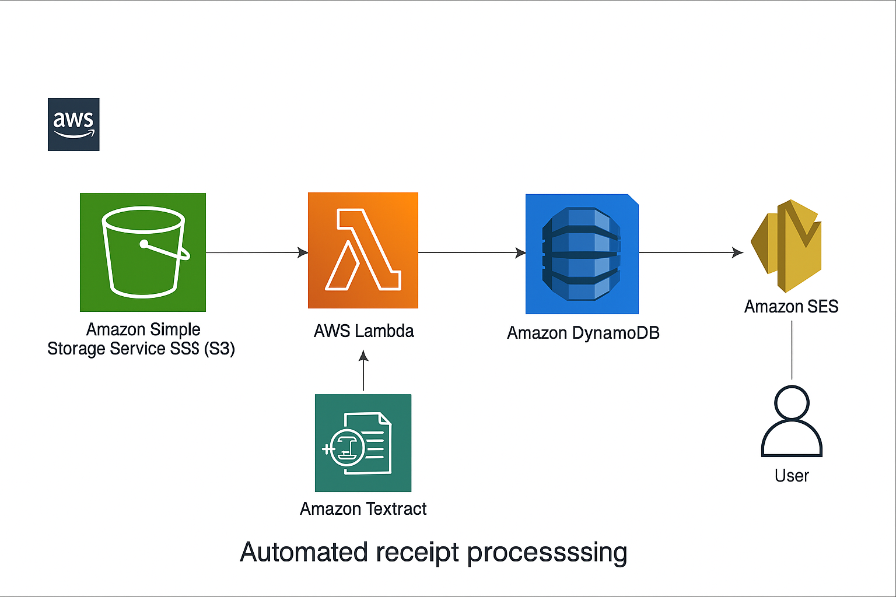

# 🧾 Automated Receipt Processing System using AWS Textract, Lambda, and DynamoDB

A **serverless cloud-based automation system** that extracts, stores, and emails key information (vendor, date, total, items) from digital or scanned receipts using AWS AI services.

---

## 🚀 Project Overview

This project automates manual receipt data entry using **AWS serverless architecture**.  
Whenever a receipt (PDF/JPG/PNG) is uploaded to an Amazon S3 bucket, an AWS Lambda function is triggered to:
1. Extract structured information using **Amazon Textract (AnalyzeExpense)**  
2. Store extracted details in **DynamoDB**  
3. Send a formatted summary email using **Amazon SES**

---

## 🧩 Architecture Diagram



**Services Used:**
- **Amazon S3** – stores uploaded receipts  
- **AWS Lambda** – processes and orchestrates actions  
- **Amazon Textract** – extracts structured data from receipts  
- **Amazon DynamoDB** – stores processed receipt details  
- **Amazon SES** – sends email notifications  

---

## ⚙️ Features

- Automatically extracts **vendor name, date, total, and items**
- Handles both **PDFs and image files**
- Stores structured output in DynamoDB
- Sends **email notifications** with extracted summary
- **Serverless architecture** (no servers to manage)
- Scalable and cost-efficient (works within AWS Free Tier)

---

## 🧠 Problem Statement

Manual entry of expense receipts is **time-consuming and error-prone**.  
Organizations and individuals often struggle to:
- Track expenses across hundreds of receipts  
- Consolidate totals for reimbursements or tax filings  
- Store and organize receipts digitally

---

## 💡 Solution

This system automates the entire pipeline:

| Step | Description |
|------|--------------|
| 1️⃣ Upload a receipt to S3 | The system detects new uploads via S3 event triggers |
| 2️⃣ Lambda executes | Calls AWS Textract to analyze the receipt |
| 3️⃣ Data extraction | Extracts fields like date, vendor, total, and line items |
| 4️⃣ Data storage | Saves the results in DynamoDB |
| 5️⃣ Notification | Sends an email summary through SES |

---

## 🧰 Tech Stack

| Layer | Technology |
|--------|-------------|
| **Compute** | AWS Lambda (Python 3.12) |
| **Storage** | Amazon S3 |
| **Database** | Amazon DynamoDB |
| **AI Service** | Amazon Textract |
| **Email Service** | Amazon SES |
| **Language** | Python (boto3) |

---

## 🧠 Future Enhancements

| Enhancement | Description |
|--------------|--------------|
| 📊 **Expense Dashboard** | Create a web interface using React/Streamlit to visualize expenses |
| 🤖 **AI Categorization** | Use Amazon Comprehend or a custom model to classify expenses by category |
| 📥 **Email Receipts Parsing** | Allow forwarding receipts via email using SES inbound routing |
| 🌍 **Multi-language Support** | Add Amazon Translate for non-English receipts |
| 🧾 **Monthly Summary Reports** | Generate PDF/CSV summaries of expenses using AWS Lambda scheduler |
| ⚙️ **CI/CD Pipeline** | Automate deployment using AWS SAM or Terraform |

---

## 📸 Sample Outputs

**Extracted DynamoDB Record:**
```json
{
  "receipt_id": "c072c185-04a7-47e3-a42e-ace7c8a0493b",
  "vendor": "amazon.com.au",
  "date": "2025-03-10",
  "total": "49.90",
  "items": [
    {"name": "Quilton Toilet Tissue", "price": "AUD24.95", "quantity": "1"},
    {"name": "Shipping Charges", "price": "AUD0.00", "quantity": "1"}
  ]
}
```

## Email Summary Example

Receipt Processed - amazon.com.au $49.90

Vendor: amazon.com.au  
Date: 10.03.2025  
Total: $49.90

Items:
- Quilton Toilet Tissue - $24.95 × 1
- Shipping Charges - $0.00 × 1

---

## Deploy from GitHub (CI/CD)

This repository includes a GitHub Actions workflow that builds and deploys the SAM stack when you push to `main` or `master`.

Workflow path: `.github/workflows/deploy-sam.yml`

What the workflow does
- Checks out the repository
- Configures AWS credentials from GitHub repository secrets
- Installs Python and the AWS SAM CLI
- Runs `sam build` and `sam deploy` to deploy the stack

Required repository secrets (set these in the GitHub repository Settings → Secrets & variables → Actions):
- `AWS_ACCESS_KEY_ID` — IAM user access key with permission to create/update CloudFormation stacks, IAM roles, DynamoDB, Textract, SES, S3.
- `AWS_SECRET_ACCESS_KEY` — The IAM user's secret key.
- `AWS_REGION` — AWS region, e.g. `us-east-1`.
- `SES_SENDER_EMAIL` — Verified SES sender email (used as CloudFormation parameter).
- `SES_RECIPIENT_EMAIL` — Recipient email for notifications (also must be verified in SES if account is in sandbox).

Notes & tips
- The workflow installs `aws-sam-cli` via pip on the runner. If you prefer a different installation method, update the workflow.
- For stronger security, consider using GitHub OIDC and an IAM role instead of long-lived secrets.


## Contact

If you want to reach out, here's contact information:

LinkedIn: https://www.linkedin.com/in/bobbydevarapu/

Email: bobbyd9676@gmail.com

